# DOKUMEN APLIKASI PROYEK 1

<p align="center">
  <br>
  <strong>UNIVERSITAS LOGISTIK DAN BISNIS INTERNASIONAL</strong>
</p>

---

## **IDENTITAS LAPORAN**
* **Nama Aplikasi:** MindClash
* **Sub-Tema:** Solusi Pembelajaran Interaktif Masa Kini Melalui Pendekatan Gamifikasi Intensif
* **Nama Kelompok:** Kelompok 30
* **Anggota Kelompok:**
  1. **Dio Ahmad Alfarisyi** (NPM: 714250015)
  2. **Mohammad Alif Syahiir** (NPM: 714250014)
* **Program Studi:** D-IV Teknik Informatika
* **Institusi:** Universitas Logistik dan Bisnis Internasional (ULBI)
* **Tahun Akademik:** 2026-2027

---
<div style="page-break-after: always;"></div>

# **KATA PENGANTAR**

Puji dan syukur penulis panjatkan kehadirat Allah SWT atas segala rahmat, hidayah, dan karunia-Nya, sehingga penulis dapat menyelesaikan laporan Dokumen Aplikasi Proyek 1 yang berjudul **"MindClash: Solusi Pembelajaran Interaktif Masa Kini Melalui Pendekatan Gamifikasi Intensif"** dengan baik dan tepat waktu.

Proyek ini disusun sebagai bagian dari luaran mata kuliah Proyek 1 pada Program Studi D-IV Teknik Informatika di Universitas Logistik dan Bisnis Internasional (ULBI) tahun akademik 2026-2027. Melalui proyek ini, diharapkan mahasiswa mampu mengintegrasikan keahlian pengembangan aplikasi web dengan kebutuhan riil di dunia pendidikan, khususnya dalam meningkatkan keterlibatan belajar siswa.

Dalam penyusunan laporan ini, penulis menyadari bahwa keberhasilan proyek ini tidak lepas dari bimbingan, dukungan, dan bantuan dari berbagai pihak. Oleh karena itu, penulis ingin menyampaikan terima kasih yang sebesar-besarnya kepada:
1. Rektor dan segenap jajaran manajemen Universitas Logistik dan Bisnis Internasional (ULBI).
2. Dekan Fakultas dan Ketua Program Studi D-IV Teknik Informatika ULBI.
3. Dosen Pembimbing Proyek 1 yang senantiasa meluangkan waktu untuk memberikan arahan, saran, dan bimbingan yang sangat berharga selama proses perancangan dan implementasi aplikasi.
4. Teman-teman satu kelompok (Kelompok 30) atas dedikasi, kerja sama yang solid, dan kerja keras yang tidak kenal lelah selama pengembangan proyek MindClash.
5. Kedua orang tua tercinta yang senantiasa mendoakan dan memberikan dukungan moral maupun spiritual.

Penulis menyadari bahwa laporan ini masih jauh dari sempurna. Oleh karena itu, kritik dan saran yang membangun dari pembaca sangat diharapkan demi penyempurnaan laporan maupun pengembangan aplikasi di masa yang akan datang. Akhir kata, semoga dokumen aplikasi ini dapat memberikan manfaat yang nyata bagi pengembangan dunia teknologi pendidikan interaktif di Indonesia.

<p align="right">
Bandung, Juli 2026<br><br><br>
<strong>Kelompok 30</strong>
</p>

---
<div style="page-break-after: always;"></div>

# **LEMBAR PERNYATAAN PERSETUJUAN DAN PERMOHONAN SIDANG PROYEK 1**

Saya sebagai Pembimbing Kelompok 30 dengan Anggota:

| Detail | Isi |
| :--- | :--- |
| **Nama Mahasiswa 1** | Dio Ahmad Alfarisyi |
| **NPM** | 714250015 |
| **Nama Mahasiswa 2** | Mohammad Alif Syahiir |
| **NPM** | 714250014 |
| **Judul Proyek 1** | Solusi Pembelajaran Interaktif Masa Kini Melalui Pendekatan Gamifikasi Intensif (Aplikasi **MindClash**) |

Menyatakan bahwa mahasiswa tersebut telah menyelesaikan semua luaran dengan kemajuan: **100%** (Seratus Persen).
* **Bagian yang belum diselesaikan (jika ada):**
  ..................................................................................................................................
  ..................................................................................................................................

Adapun penulisan laporan Akhir Proyek 1 telah diselesaikan seluruhnya (100%) Dengan demikian saya mengajukan mahasiswa tersebut untuk mengikuti sidang Proyek 1. Apabila ternyata pernyataan saya tersebut tidak benar, maka saya menyetujui penundaan sidang termasuk pembatalan sidang Proyek 1 untuk mahasiswa bimbingan saya tersebut sesuai aturan yang berlaku.

<p align="center">Bandung, 4 Juli 2026</p>

<table width="100%">
  <tr>
    <td width="50%" align="left" style="border: none;">
      <strong>Mahasiswa 1</strong><br><br><br><br>
      <u>Dio Ahmad Alfarisyi</u><br>
      NPM : 714250015<br><br>
      <strong>Mahasiswa 2</strong><br><br><br><br>
      <u>Mohammad Alif Syahiir</u><br>
      NPM : 714250014
    </td>
    <td width="50%" align="left" style="border: none; vertical-align: top;">
      <strong>Dosen Pembimbing</strong><br><br><br><br>
      <u>________________________</u><br>
      NIK :
    </td>
  </tr>
</table>

---
<div style="page-break-after: always;"></div>

# **LEMBAR PENGESAHAN**

<p align="center"><strong>&lt; SOLUSI PEMBELAJARAN INTERAKTIF MASA KINI MELALUI PENDEKATAN GAMIFIKASI INTENSIF &gt;</strong></p>

<table width="100%" style="border: none;">
  <tr style="border: none;">
    <td style="border: none;">Nama Mahasiswa 1: <strong>Dio Ahmad Alfarisyi</strong></td>
    <td align="right" style="border: none;">NPM: <strong>714250015</strong></td>
  </tr>
  <tr style="border: none;">
    <td style="border: none;">Nama Mahasiswa 2: <strong>Mohammad Alif Syahiir</strong></td>
    <td align="right" style="border: none;">NPM: <strong>714250014</strong></td>
  </tr>
</table>

<p align="center">
Dokumen Proyek 1 ini telah diperiksa, disetujui, dan disidangkan<br>
Di Bandung, 4 Juli 2026
</p>

<p align="center"><strong>Oleh:</strong></p>

<table width="100%">
  <tr>
    <td width="50%" align="center">
      <strong>Penguji Pendamping,</strong><br><br><br><br>
      <u>________________________</u><br>
      NIK:
    </td>
    <td width="50%" align="center">
      <strong>Penguji Utama,</strong><br><br><br><br>
      <u>________________________</u><br>
      NIK:
    </td>
  </tr>
  <tr>
    <td align="center"><br>
      <strong>Pembimbing,</strong><br><br><br><br>
      <u>________________________</u><br>
      NIK:
    </td>
    <td align="center"><br>
      <strong>Koordinator Proyek 1,</strong><br><br><br><br>
      <u>________________________</u><br>
      NIK:
    </td>
  </tr>
  <tr>
    <td colspan="2" align="center"><br>
      <strong>Menyetujui,</strong><br>
      <strong>Ketua Program Studi D-IV Teknik Informatika,</strong><br><br><br><br>
      <u>________________________</u><br>
      NIK:
    </td>
  </tr>
</table>

---
<div style="page-break-after: always;"></div>

# **DAFTAR ISI**

* **KATA PENGANTAR**
* **LEMBAR PERNYATAAN PERSETUJUAN DAN PERMOHONAN SIDANG**
* **LEMBAR PENGESAHAN**
* **DAFTAR ISI**
* **BAB 1: PENDAHULUAN**
  * 1.1 Latar Belakang
  * 1.2 Nama Aplikasi dan Dasar Ide
    * 1.2.1 Deskripsi Nama Aplikasi
    * 1.2.2 Dasar Ide Pengembangan
  * 1.3 Tujuan Pengembangan
    * 1.3.1 Tujuan Umum
    * 1.3.2 Tujuan Khusus
  * 1.4 Ruang Lingkup
* **BAB 2: DESKRIPSI SISTEM**
  * 2.1 Gambaran Umum Aplikasi
  * 2.2 Stakeholder dan User
  * 2.3 Kebutuhan Fungsional
  * 2.4 Kebutuhan Non-Fungsional
* **BAB 3: PERANCANGAN SISTEM**
  * 3.1 Arsitektur Sistem
  * 3.2 Workflow Sistem
  * 3.3 Class Diagram
  * 3.4 Entity Relationship Diagram (ERD)
* **BAB 4: DESAIN ANTARMUKA**
  * 4.1 Konsep Desain
  * 4.2 Mockup / Wireframe
  * 4.3 Deskripsi Tampilan
* **BAB 5: IMPLEMENTASI DASAR**
  * 5.1 Tools dan Teknologi
  * 5.2 Struktur Folder Proyek
  * 5.3 Petunjuk Menjalankan Aplikasi
* **BAB 6: PENUTUP**
  * 6.1 Kesimpulan
  * 6.2 Saran Pengembangan
* **DAFTAR PUSTAKA**

---
<div style="page-break-after: always;"></div>

# **BAB 1: PENDAHULUAN**

### **1.1 Latar Belakang**
Perkembangan teknologi informasi yang masif di era digital telah membawa transformasi besar pada sektor pendidikan, khususnya dalam restrukturisasi media pembelajaran [1]. Keberhasilan suatu proses edukasi sangat dipengaruhi oleh tingkat ketertarikan dan motivasi intrinsik peserta didik. Namun, dalam realitasnya, ekosistem pembelajaran konvensional masih sering didominasi oleh metode satu arah yang bersifat kaku dan monoton [2]. 

Kondisi tersebut berdampak langsung pada penurunan atensi, rendahnya keterlibatan aktif, serta minimnya motivasi belajar siswa di kelas [2]. Oleh karena itu, penerapan metode Game-Based Learning (GBL) atau gamifikasi menjadi urgensi krusial sebagai instrumen alternatif yang mampu merancang ruang belajar digital yang adaptif, berpusat pada siswa, serta sejalan dengan kebutuhan dinamika pendidikan modern saat ini [1].

Keberhasilan suatu proses pembelajaran tidak terlepas dari peran sentral seorang guru dalam merancang ekosistem belajar yang kondusif, menantang, dan menyenangkan. Sebagaimana ditegaskan oleh [3], guru merupakan komponen terpenting yang menentukan keberhasilan peserta didik, sehingga seorang pendidik dituntut mampu memilih metode dan media pembelajaran yang tepat guna membangun suasana belajar yang mampu membangkitkan semangat siswa. Tuntutan ini menjadi semakin relevan mengingat masih dominannya pendekatan konvensional yang bersifat satu arah dan minim interaksi, yang berdampak langsung pada menurunnya partisipasi aktif, melemahnya konsentrasi, serta terkikisnya motivasi intrinsik siswa di dalam kelas.

Dalam upaya mengatasi problem matinya partisipasi aktif siswa, platform edukasi berbasis gamifikasi populer seperti Quizizz dan Kahoot! telah banyak diadopsi secara luas sebagai instrumen alternatif yang mampu merancang ruang belajar digital yang adaptif dan berpusat pada siswa. Adopsi yang masif ini ditopang oleh bukti empiris yang kuat: [3] membuktikan secara eksperimental bahwa penggunaan Kahoot menghasilkan perbedaan motivasi belajar yang signifikan antara kelas eksperimen dan kelas kontrol dengan nilai signifikansi 0,000 < 0,05, menegaskan bahwa platform ini mampu merangsang keaktifan dan kecepatan berpikir siswa secara terukur. Senada dengan hal tersebut, [4] melalui studi komparatifnya mengungkapkan bahwa Kahoot sangat efektif meningkatkan motivasi melalui sistem kompetitif berbasis leaderboard untuk sesi langsung di kelas, sementara Quizizz unggul dalam fleksibilitas belajar mandiri dengan laporan hasil yang lebih terperinci untuk keperluan evaluasi formatif. 

Dengan demikian, kajian mengenai solusi pembelajaran interaktif melalui pendekatan gamifikasi intensif menjadi penting untuk dilakukan guna memberikan panduan praktis bagi pendidik dalam merancang pengalaman belajar yang lebih adaptif dan bermakna bagi generasi pelajar digital saat ini. Berbagai riset membuktikan bahwa integrasi platform interaktif semacam Quizizz sangat efektif digunakan sebagai media evaluasi pembelajaran digital karena mampu menstimulasi antusiasme kompetitif siswa melalui visualisasi yang interaktif [5].

Meskipun begitu, penggunaan platform umum tersebut di lapangan masih memiliki batasan-batasan tertentu. Model kuis yang ada sekarang biasanya terlalu fokus pada seberapa cepat seseorang menjawab, sehingga siswa cenderung menebak jawaban dengan spekulatif untuk mendapatkan posisi yang baik di papan peringkat. Selain itu, ketergantungan platform kuis biasa pada adanya interaksi banyak pemain secara langsung membuat proses belajar sendiri yang dilakukan secara tidak bersamaan menjadi kurang menantang dan kurang terkelola dengan baik.

Dari perbedaan fungsi tersebut, dibuatlah sebuah sistem informasi baru yang disebut MindClash dengan fokus pada sub-tema "Solusi Pembelajaran Interaktif Saat Ini Melalui Pendekatan Gamifikasi yang Intensif". Aplikasi ini tidak hanya dibuat sebagai alat penilaian digital biasa, tetapi juga sebagai platform untuk belajar sendiri yang menggabungkan elemen permainan dengan cara yang mendalam.

MindClash memperkenalkan inovasi baru dengan sistem nyawa (mode bertahan hidup) serta visualisasi umpan balik langsung berupa penjelasan konteks setelah setiap soal. Pendekatan gamifikasi yang intens ini bertujuan untuk memberikan dorongan psikologis yang positif bagi pengguna. Hal ini dilakukan agar mereka dapat melatih kemampuan berpikir kritis, membantu mereka melakukan evaluasi diri ketika terjadi kesalahan, dan juga memberikan kebebasan bagi siswa untuk mengembangkan keterampilan mereka kapan saja secara mandiri tanpa harus bergantung pada kehadiran orang lain.

Untuk mewujudkan sistem kuis yang dinamis dan terstruktur, aplikasi MindClash dibuat dengan arsitektur yang memisahkan bagian frontend dan backend (arsitektur client-server). Ini bertujuan untuk meningkatkan fleksibilitas dan kinerja sistem. 

Dalam bagian tampilan pengguna, aplikasi ini dirancang dengan antarmuka depan menggunakan Laravel Blade Template yang disempurnakan dengan Tailwind CSS untuk menyajikan visualisasi yang responsif, interaktif, dan mudah digunakan. Di sisi backend, digunakan bahasa pemrograman PHP dengan framework Laravel 12 yang terhubung langsung dengan sistem basis data relasional. Laravel dipilih karena fitur-fitur bawaannya seperti sistem routing, ORM Eloquent, dan middleware yang secara signifikan mempercepat proses pengembangan sekaligus menjaga keteraturan struktur kode backend.

Dengan kerja sama teknologi ini, pengelolaan data yang berubah-ubah melalui fitur Buat, Baca, Perbarui, dan Hapus (CRUD) bisa berjalan dengan baik. Sistem ini dapat memastikan bahwa setiap proses manajemen data mengenai soal, riwayat sesi permainan, pengumpulan skor di papan peringkat, dan pencapaian lencana dapat berjalan dengan cara yang teratur, konsisten, dan aman. Dengan desain arsitektur yang kuat menggunakan PHP dan Tailwind CSS, aplikasi MindClash diharapkan bisa menjadi alat belajar yang interaktif, menantang, dan berkelanjutan untuk meningkatkan kualitas pemahaman akademis para siswa.

### **1.2 Nama Aplikasi dan Dasar Ide**
#### **1.2.1 Deskripsi Nama Aplikasi**
Aplikasi yang dikembangkan dalam proyek ini diberi nama **MindClash**. Nama "MindClash" merupakan gabungan dari dua kata dalam bahasa Inggris, yakni *Mind* yang berarti kecerdasan dan *Clash* yang berarti kompetisi, sehingga secara keseluruhan MindClash dapat dimaknai sebagai **"Kompetisi Kecerdasan"**. Pemilihan nama ini merepresentasikan visi utama aplikasi, yaitu menciptakan sebuah arena belajar digital di mana pengguna tidak hanya sekadar menjawab soal, tetapi juga ditantang untuk berkompetisi secara intelektual bersama sesama pengguna. Sebagai sebuah platform pembelajaran interaktif berbasis gamifikasi, MindClash dirancang untuk mengubah pengalaman belajar yang pasif menjadi sebuah kompetisi kecerdasan yang menantang, menyenangkan, dan bermakna.

#### **1.2.2 Dasar Ide Pengembangan**
Ide pengembangan MindClash berangkat dari pengamatan terhadap permasalahan nyata yang kerap dijumpai dalam proses belajar sehari-hari. Berdasarkan kondisi yang telah dipaparkan pada latar belakang, munculnya ide aplikasi ini didasari oleh dua permasalahan pokok, yakni:
1. **Platform kuis yang ada terlalu berfokus pada kecepatan menjawab, bukan pada pemahaman.** Dalam keseharian, siswa yang menggunakan platform kuis populer cenderung didorong untuk menjawab secepat mungkin demi memperoleh posisi tertinggi di papan peringkat. Akibatnya, siswa lebih sering menebak jawaban secara spekulatif daripada benar-benar memahami materi. Kondisi ini menginspirasi perlunya fitur umpan balik kontekstual yang memberikan penjelasan setelah setiap soal dijawab, agar proses belajar tetap berlangsung meskipun siswa melakukan kesalahan.
2. **Siswa mudah bosan dengan metode belajar konvensional di kelas.** Pendekatan pembelajaran yang monoton dan satu arah terbukti menurunkan motivasi dan keterlibatan aktif siswa. Kondisi ini menginspirasi penerapan pendekatan gamifikasi intensif pada MindClash, seperti sistem nyawa pada mode bertahan hidup, yang memberikan dorongan psikologis positif agar siswa tetap termotivasi dan terlibat aktif dalam setiap sesi belajar.

Melalui integrasi kedua permasalahan harian tersebut, MindClash diposisikan bukan sekadar alat evaluasi digital biasa, melainkan sebagai solusi pembelajaran interaktif yang komprehensif bagi siswa untuk mengembangkan kecerdasan dan kemampuan berpikir kritis secara mandiri, kapan saja, dan di mana saja.

### **1.3 Tujuan Pengembangan**
#### **1.3.1 Tujuan Umum**
Mengembangkan platform pembelajaran interaktif berbasis gamifikasi intensif yang mampu meningkatkan motivasi dan partisipasi aktif siswa dalam belajar, sekaligus menghadirkan pengalaman belajar yang menantang dan menyenangkan melalui integrasi elemen permainan yang mendalam ke dalam proses evaluasi dan penguatan pemahaman materi.

#### **1.3.2 Tujuan Khusus**
1. **Mengimplementasikan Sistem Nyawa sebagai Elemen Gamifikasi:** Menerapkan mekanisme sistem nyawa pada mode bertahan hidup sebagai instrumen gamifikasi intensif yang memberikan dorongan psikologis positif, mendorong siswa untuk lebih berhati-hati dalam menjawab, serta melatih kemampuan berpikir kritis dan evaluasi diri ketika terjadi kesalahan.
2. **Menyediakan Umpan Balik Kontekstual Setelah Setiap Soal:** Membangun sistem visualisasi umpan balik langsung berupa penjelasan konteks setelah setiap soal dijawab, sehingga proses belajar tetap berlangsung secara bermakna dan siswa tidak hanya sekadar mengetahui jawaban yang benar, tetapi juga memahami alasan di baliknya.

#### **1.4 Ruang Lingkup**
1. **Fokus Penelitian:** Penelitian ini berfokus pada pengembangan sistem informasi kuis pembelajaran interaktif berbasis web yang diberi nama MindClash, dengan sub-tema "Solusi Pembelajaran Interaktif Saat Ini Melalui Pendekatan Gamifikasi yang Intensif". Penelitian ini bertujuan untuk menyediakan media evaluasi dan pembelajaran mandiri secara asinkron serta kompetitif yang mendalam bagi siswa, dengan mengimplementasikan arsitektur monolitik terstruktur menggunakan teknologi PHP sebagai backend (pengelola logika bisnis dan basis data relasional) serta Blade dan JavaScript vanilla sebagai frontend (antarmuka pengguna yang responsif).
2. **Batasan Sistem MindClash:** Sistem ini dirancang untuk mengintegrasikan elemen gamifikasi intensif yang mencakup fitur sistem nyawa (mode bertahan hidup), umpan balik langsung berupa penjelasan konteks setelah setiap soal, pengelolaan papan peringkat (leaderboard), pencapaian lencana (badges), serta **multiplayer room kuis** untuk pengerjaan kuis bersama. Cakupan pengembangan sistem ini terbatas pada platform aplikasi web dan tidak mencakup pengembangan aplikasi mobile.
3. **Aktor Sistem:** Pengguna yang terlibat di dalam sistem ini dibatasi pada 2 (dua) peran utama dengan hak akses sebagai berikut:
   * **Admin:** Pihak yang bertanggung jawab penuh dalam mengelola seluruh data sistem melalui fitur CRUD (Buat, Baca, Perbarui, dan Hapus), yang meliputi manajemen data soal kuis, pemantauan riwayat sesi permainan, pengelolaan akumulasi skor papan peringkat, serta pengaturan pencapaian lencana.
   * **Siswa (Pengguna):** Pengguna yang memanfaatkan platform secara mandiri untuk mengakses kuis (mode bertahan hidup maupun pengerjaan bersama melalui multiplayer room), menerima umpan balik/penjelasan konteks soal, melihat peringkat pada leaderboard, serta melacak lencana pencapaian yang telah diperoleh.

---
<div style="page-break-after: always;"></div>

# **BAB 2: DESKRIPSI SISTEM**

### **2.1 Gambaran Umum Aplikasi**
MindClash adalah sebuah platform pembelajaran interaktif (*gamified learning*) berbasis web yang dirancang untuk meningkatkan motivasi belajar siswa SMP melalui pendekatan kompetisi yang menyenangkan. Aplikasi ini bekerja dengan cara mengubah proses belajar konvensional menjadi pengalaman bermain melalui kuis pilihan ganda yang dikelompokkan berdasarkan topik atau mata pelajaran, dipadukan dengan sistem duel/battle antar pengguna secara real-time ke dalam satu platform yang terpusat.

Aplikasi ini bisa digunakan sebagai tempat belajar sekaligus berlomba. Siswa bisa memilih topik kuis yang ingin dipelajari, menghadapi tantangan dari siswa lain dalam sesi pertandingan untuk menjawab soal dengan lebih cepat dan lebih benar, mendapatkan poin atau XP setiap kali mereka menyelesaikan kuis atau pertandingan, serta memantau letak mereka di leaderboard yang menampilkan peringkat pengguna secara berkala.

Dengan sistem kompetisi dan poin ini, proses belajar yang dulu hanya dilakukan secara pasif kini menjadi lebih aktif, terukur, dan mendorong siswa untuk terus meningkatkan pemahaman terhadap materi.

### **2.2 Stakeholder dan User**
Berdasarkan batasan aktor sistem yang telah dijelaskan pada sub-bab Ruang Lingkup, pengguna yang terlibat secara langsung dalam sistem MindClash dibatasi pada 2 (dua) peran utama, yaitu Admin dan Siswa (Pengguna). Kedua peran ini memiliki hak akses yang berbeda sesuai dengan fungsi dan tanggung jawab masing-masing di dalam sistem, sebagaimana dijabarkan pada tabel berikut.

| No | Aktor / User | Deskripsi | Hak Akses |
| :-: | :--- | :--- | :--- |
| **1** | **Admin** | Pihak yang bertanggung jawab penuh dalam mengelola seluruh data dan konten di dalam sistem MindClash. | a. Melakukan CRUD (Buat, Baca, Perbarui, Hapus) data soal kuis dan kategori.<br>b. Memantau riwayat sesi permainan siswa.<br>c. Mengelola akumulasi skor pada leaderboard.<br>d. Mengatur pencapaian lencana (badges). |
| **2** | **Siswa (Pengguna)** | Pengguna akhir yang memanfaatkan aplikasi sebagai media belajar mandiri sekaligus berkompetisi dengan rekan sejawat. | a. Mengakses dan mengerjakan kuis berdasarkan kategori pelajaran.<br>b. Memilih Mode Bertahan Hidup/Kuis Terjadwal.<br>c. Menerima umpan balik/penjelasan konteks setelah menjawab kuis.<br>d. Melihat posisi dan peringkat pada leaderboard kelas.<br>e. Melacak lencana pencapaian (badges) yang diperoleh.<br>f. Membuat dan bergabung dengan ruang kuis kompetitif bersama (*Multiplayer Room*). |

### **2.3 Kebutuhan Fungsional**
Kebutuhan fungsional merupakan fitur-fitur utama yang harus disediakan oleh sistem MindClash agar dapat berjalan sesuai dengan tujuan dan ruang lingkup yang telah ditetapkan. Berdasarkan pembagian aktor pada sub-bab sebelumnya, kebutuhan fungsional dikelompokkan menjadi 2 (dua) bagian, yaitu kebutuhan fungsional untuk Admin dan kebutuhan fungsional untuk Siswa (Pengguna).

#### **A. Kebutuhan Fungsional untuk Admin**
1. Sistem dapat menyediakan fitur Buat, Baca, Perbarui, dan Hapus (CRUD) data soal kuis dan kategori bagi Admin.
2. Sistem dapat menampilkan riwayat sesi permainan siswa agar dapat dipantau oleh Admin.
3. Sistem dapat mengelola akumulasi skor pengguna pada papan peringkat (leaderboard).
4. Sistem dapat mengatur data pencapaian lencana (badges) yang dapat diperoleh siswa.
5. Sistem dapat mengunduh dan mencetak laporan nilai kuis siswa dalam format PDF.

#### **B. Kebutuhan Fungsional untuk Siswa (Pengguna)**
1. Sistem dapat menampilkan kuis pilihan ganda yang dikelompokkan berdasarkan topik atau mata pelajaran.
2. Sistem dapat menyediakan Mode Kuis dengan batas waktu (timer) sebagai instrumen gamifikasi.
3. Sistem dapat menampilkan antarmuka kuis satu per satu dengan transisi tombol navigasi "Sebelumnya" dan "Selanjutnya".
4. Sistem dapat menyimpan hasil pengerjaan kuis siswa secara otomatis saat waktu pengerjaan habis.
5. Sistem dapat menampilkan riwayat pengerjaan kuis beserta review detail jawaban yang benar dan salah.
6. Sistem dapat menampilkan posisi dan peringkat pengguna secara berkala pada papan peringkat (leaderboard) berdasarkan kelas masing-masing.
7. Sistem dapat memfasilitasi pembuatan ruang kuis kompetitif bersama (*Multiplayer Room*) dengan kode akses unik.
8. Sistem dapat menampilkan ruang tunggu (*Lobby Room*) multiplayer berisi daftar peserta kuis.
9. Sistem dapat menampilkan papan peringkat khusus (*Room Leaderboard*) yang merangkum nilai kuis room secara real-time.

### **2.4 Kebutuhan Non-Fungsional**
Kebutuhan non-fungsional merupakan kebutuhan yang berkaitan dengan kualitas dan karakteristik operasional sistem MindClash, di luar fitur-fitur utama yang telah dijabarkan pada sub-bab sebelumnya. Berdasarkan arsitektur dan teknologi yang digunakan dalam pengembangan aplikasi, kebutuhan non-fungsional MindClash dikelompokkan menjadi 3 (tiga) aspek, yaitu kecepatan sistem, kemudahan penggunaan, dan keamanan sederhana.

#### **A. Kecepatan Sistem (Performance)**
1. Sistem dapat meminimalkan pemuatan ulang halaman secara berlebihan dengan rendering yang efisien pada sisi klien menggunakan Tailwind CSS dan Vanilla JS.
2. Sistem dapat memproses logika bisnis dan pengelolaan data pada sisi backend menggunakan framework Laravel 12 yang efisien dan cepat melalui ORM Eloquent.
3. Sistem dapat mengelola database dengan indeks yang tepat agar kueri leaderboard dan kuis berjalan kurang dari 1 detik.

#### **B. Kemudahan Penggunaan (Usability)**
1. Sistem dapat menyediakan antarmuka yang responsif (mobile-friendly), interaktif, dan mudah digunakan oleh siswa SMP.
2. Sistem dapat menyajikan skema warna bertema gelap (Dark Mode) yang modern untuk mengurangi kelelahan mata siswa saat belajar dalam durasi lama.
3. Sistem dapat diakses langsung melalui web browser populer (Chrome, Firefox, Safari, Edge) tanpa memerlukan proses instalasi aplikasi tambahan.

#### **C. Keamanan Sederhana (Security)**
1. Sistem dapat melindungi data kredensial pengguna menggunakan enkripsi *hashing* satu arah (BCrypt) untuk password.
2. Sistem dapat menerapkan middleware otentikasi untuk mencegah pengguna yang tidak terotentikasi mengakses halaman dasbor siswa maupun admin.
3. Sistem dapat menerapkan middleware pembatasan hak akses (*role-based authorization*) agar peran Siswa tidak dapat mengakses dasbor Admin.

---
<div style="page-break-after: always;"></div>

# **BAB 3: PERANCANGAN SISTEM**

### **3.1 Arsitektur & Deployment Sistem**

#### **3.1.1 Arsitektur Sistem**
Aplikasi **MindClash** menggunakan pola arsitektur **Model-View-Controller (MVC)** yang ditawarkan oleh framework Laravel. Sistem ini dikembangkan secara monolitik modern, di mana backend dan frontend terintegrasi dalam satu repositori namun dipisahkan secara logis. Komunikasi antara frontend (klien) dan backend (server) dilakukan melalui protokol HTTP/HTTPS.

Berikut adalah diagram blok hubungan arsitektur sistem MindClash:

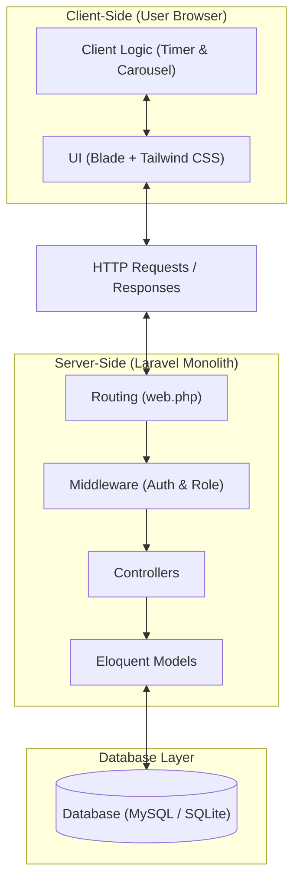

* **Client-Side (Browser):** Pengguna berinteraksi dengan antarmuka web yang dibuat menggunakan Laravel Blade dan dipercantik dengan Tailwind CSS. JavaScript vanilla menangani logika interaktif kuis seperti perpindahan soal, timer mundur, dan visualisasi pilihan jawaban.
* **Server-Side (Laravel):** Router menerima permintaan dari browser, memfilternya melalui middleware (untuk pengecekan login dan hak akses admin/user), lalu meneruskannya ke Controller yang bersesuaian. Controller akan memproses logika bisnis dan berinteraksi dengan basis data melalui Eloquent ORM.
* **Database Layer:** Menyimpan seluruh data secara terstruktur, termasuk profil pengguna, daftar pertanyaan, pengelompokan kategori, dan riwayat hasil kuis.

#### **3.1.2 Deployment Diagram**
Deployment Diagram di bawah memetakan penempatan fisik komponen perangkat lunak (klien browser, Laravel web server, MySQL database) ke dalam node perangkat keras beserta protokol komunikasinya:

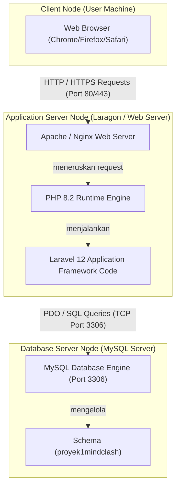

### **3.2 Use Case & Workflow Sistem**

#### **3.2.1 Use Case Diagram**
Use Case Diagram di bawah menggambarkan interaksi aktor (Siswa dan Admin) dengan fitur-fitur utama sistem MindClash, termasuk modul multiplayer room:

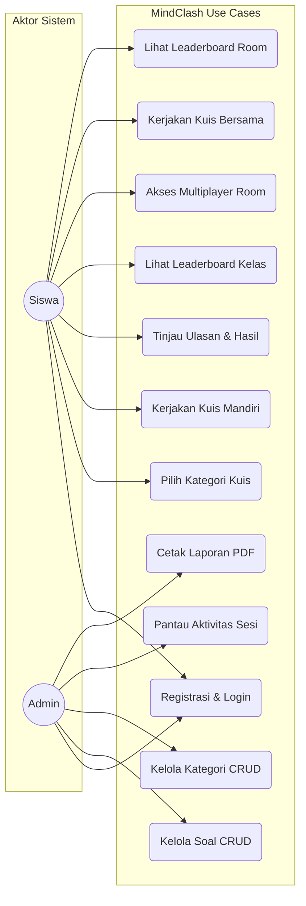

#### **3.2.2 Alur Kerja (Workflow) Sistem**
Berikut merupakan alur kerja (workflow) utama sistem untuk aktor Siswa saat mengerjakan kuis, alur kerja Admin untuk mengelola data soal, serta alur kerja kuis berkelompok (*Multiplayer Room*).

#### **A. Workflow Pengerjaan Kuis oleh Siswa**
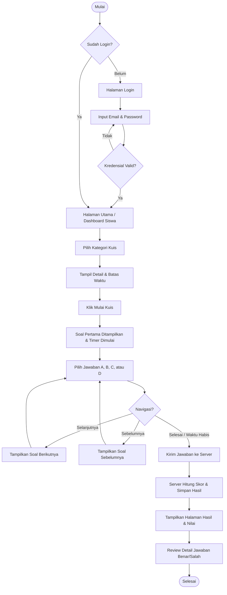

#### **B. Workflow Manajemen Data Soal oleh Admin**
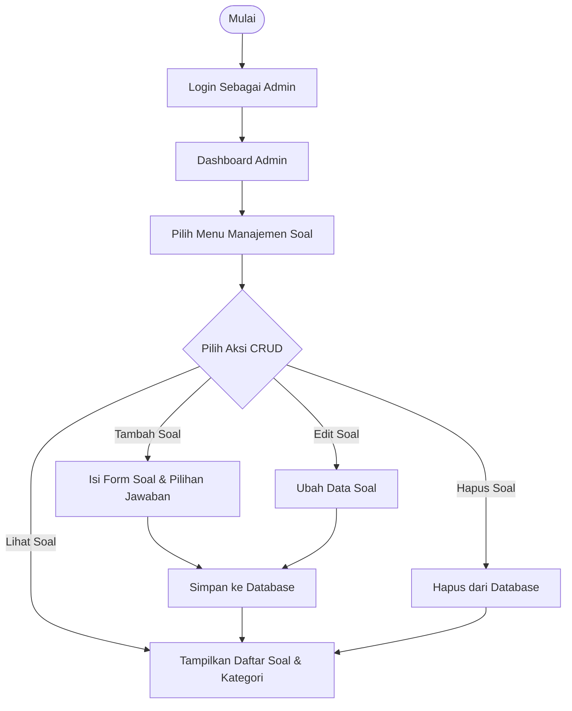

#### **C. Workflow Kuis Bersama (Multiplayer Room)**
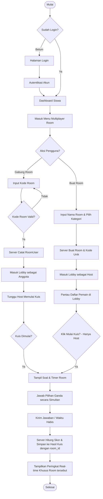

### **3.3 Class Diagram**
Class Diagram berikut menunjukkan struktur model Eloquent pada aplikasi MindClash yang menangani representasi data dan relasi antar entitas, termasuk penambahan modul multiplayer.

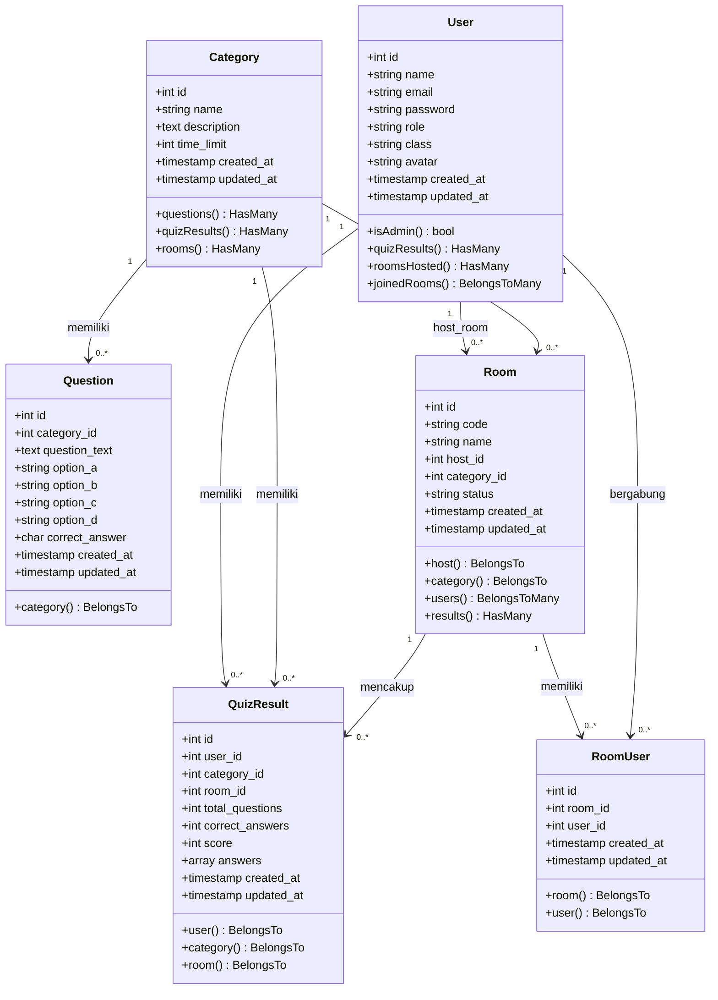

### **3.4 Entity Relationship Diagram (ERD)**
ERD berikut memetakan struktur tabel database relasional beserta tipe data, primary key (PK), foreign key (FK), dan kardinalitas antar tabel pada database MindClash dengan integrasi multiplayer rooms.

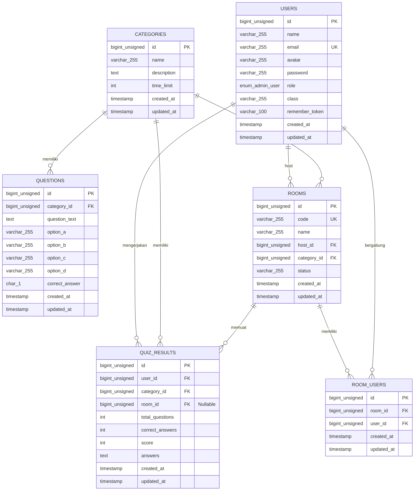

#### **A. Penjelasan Tipe Data Database**
Setiap tabel dalam database MindClash memiliki tipe data yang disesuaikan dengan kebutuhan penyimpanan data secara efisien dan aman:
1. **Tabel `users`:**
   - `id` (`bigint unsigned`, Primary Key, Auto Increment): Menggunakan alokasi memori besar (8 byte) dengan penandaan unik otomatis untuk merepresentasikan identitas pengguna.
   - `name` (`varchar(255)`): Menyimpan nama lengkap pengguna dengan batas maksimum 255 karakter bertipe string alfanumerik.
   - `email` (`varchar(255)`, Unique): Menyimpan alamat surel pengguna yang berfungsi sebagai kredensial login unik di dalam sistem.
   - `avatar` (`varchar(255)`, Nullable): Menyimpan tautan path atau nama file gambar profil pengguna. Bernilai NULL jika pengguna belum mengunggah foto profil.
   - `password` (`varchar(255)`): Menyimpan kata sandi pengguna dalam format hash terenkripsi (BCrypt) untuk menjamin keamanan kredensial.
   - `role` (`enum('admin', 'user')`, Default 'user'): Tipe data enumerasi yang membatasi hak akses pengguna secara ketat antara peran Administrator dan Siswa.
   - `class` (`varchar(255)`, Nullable): Menyimpan string identitas kelas siswa (misal: "7A", "7B"). Bernilai NULL untuk peran admin.
   - `remember_token` (`varchar(100)`, Nullable): Token alfanumerik untuk menjaga sesi masuk tetap aktif (fitur "Remember Me").
   - `created_at` & `updated_at` (`timestamp`, Nullable): Menyimpan informasi waktu pembuatan dan pembaruan data secara otomatis oleh Laravel.

2. **Tabel `categories`:**
   - `id` (`bigint unsigned`, Primary Key, Auto Increment): Identitas unik untuk pengelompokan kategori kuis.
   - `name` (`varchar(255)`): Nama kategori mata pelajaran kuis (contoh: "Matematika", "IPA (Sains)").
   - `description` (`text`, Nullable): Menyimpan penjelasan deskriptif kategori dengan kapasitas penyimpanan teks yang besar.
   - `time_limit` (`int`, Default 10): Menyimpan batas durasi pengerjaan kuis dalam satuan menit menggunakan tipe integer.

3. **Tabel `questions`:**
   - `id` (`bigint unsigned`, Primary Key, Auto Increment): Identitas unik untuk setiap butir soal kuis.
   - `category_id` (`bigint unsigned`, Foreign Key): Menghubungkan soal ke kategori di tabel `categories` dengan relasi integritas referensial `ON DELETE CASCADE`.
   - `question_text` (`text`): Teks narasi pertanyaan kuis berukuran besar.
   - `option_a`, `option_b`, `option_c`, `option_d` (`varchar(255)`): Menyimpan opsi pilihan ganda yang disajikan kepada siswa.
   - `correct_answer` (`char(1)`): Menyimpan satu karakter penanda kunci jawaban benar (bernilai 'A', 'B', 'C', atau 'D').

4. **Tabel `quiz_results`:**
   - `id` (`bigint unsigned`, Primary Key, Auto Increment): Identitas sesi hasil pengerjaan kuis.
   - `user_id` (`bigint unsigned`, Foreign Key): Menghubungkan riwayat kuis ke pengguna di tabel `users` dengan aturan `ON DELETE CASCADE`.
   - `category_id` (`bigint unsigned`, Foreign Key): Menghubungkan riwayat kuis ke tabel `categories` dengan aturan `ON DELETE CASCADE`.
   - `room_id` (`bigint unsigned`, Foreign Key, Nullable): Menghubungkan riwayat kuis ke tabel `rooms` jika kuis dikerjakan melalui Multiplayer Room. Bernilai NULL untuk kuis belajar mandiri (single player).
   - `total_questions` (`int`): Menyimpan jumlah total soal kuis yang dikerjakan.
   - `correct_answers` (`int`): Menyimpan jumlah jawaban siswa yang bernilai benar.
   - `score` (`int`): Nilai akhir kuis siswa dalam skala 0 hingga 100.
   - `answers` (`text`, Nullable): Menyimpan struktur data JSON dari jawaban yang dipilih siswa (format pemetaan: `id_soal => pilihan_jawaban`) untuk keperluan peninjauan kembali (*review*).

5. **Tabel `rooms`:**
   - `id` (`bigint unsigned`, Primary Key, Auto Increment): Identitas unik untuk multiplayer kuis room.
   - `code` (`varchar(255)`, Unique): Menyimpan string token kode acak unik (contoh: "ROOM12A") yang dibagikan host agar anggota lain dapat bergabung.
   - `name` (`varchar(255)`): Nama room kuis yang diatur oleh host (contoh: "Cerdas Cermat Kelas 7A").
   - `host_id` (`bigint unsigned`, Foreign Key): Menghubungkan room ke pembuat room (`users.id`) dengan aturan `ON DELETE CASCADE`.
   - `category_id` (`bigint unsigned`, Foreign Key): Menghubungkan kuis room ke tabel `categories` dengan aturan `ON DELETE CASCADE`.
   - `status` (`varchar(255)`, Default 'waiting'): Menyimpan status berjalan kuis: "waiting" (di lobby), "active" (kuis berjalan), dan "finished" (selesai).
   - `created_at` & `updated_at` (`timestamp`, Nullable): Waktu pembuatan dan pembaruan data otomatis.

6. **Tabel `room_users` (Pivot Table):**
   - `id` (`bigint unsigned`, Primary Key, Auto Increment): Identitas unik entri pivot.
   - `room_id` (`bigint unsigned`, Foreign Key): Merujuk ke tabel `rooms.id` dengan aturan `ON DELETE CASCADE`.
   - `user_id` (`bigint unsigned`, Foreign Key): Merujuk ke tabel `users.id` dengan aturan `ON DELETE CASCADE` untuk menyimpan daftar siswa di dalam room.
   - `created_at` & `updated_at` (`timestamp`, Nullable): Waktu pencatatan bergabung pemain.

#### **B. Penjelasan Hubungan Relasi (Cardinality) ERD**
Hubungan relasional antar entitas dalam database MindClash didasarkan pada aturan bisnis dan integritas data sebagai berikut:
1. **Hubungan `users` ke `quiz_results` (One-to-Many / 1:N):**
   * **Logika:** Seorang Siswa (`users` dengan role 'user') dapat mengerjakan kuis berulang kali pada kategori yang sama maupun berbeda, sehingga menghasilkan banyak rekaman data hasil kuis (`quiz_results`). Sebaliknya, setiap satu baris data hasil kuis (`quiz_results`) hanya boleh dimiliki oleh tepat satu orang Siswa.
   * **Kardinalitas:** `USERS (1) <--- mengerjakan ---> (0..*) QUIZ_RESULTS`.
2. **Hubungan `categories` ke `questions` (One-to-Many / 1:N):**
   * **Logika:** Satu kategori kuis mata pelajaran (`categories`) dapat memuat banyak butir soal pertanyaan (`questions`) di dalam bank soal. Namun, setiap satu butir soal kuis (`questions`) hanya ditugaskan pada tepat satu kategori mata pelajaran tertentu agar pengelompokan data tetap konsisten.
   * **Kardinalitas:** `CATEGORIES (1) <--- memiliki ---> (0..*) QUESTIONS`.
3. **Hubungan `categories` ke `quiz_results` (One-to-Many / 1:N):**
   * **Logika:** Satu kategori kuis (`categories`) dapat dikerjakan dalam banyak sesi ujian oleh berbagai siswa sehingga melahirkan banyak data hasil kuis (`quiz_results`). Di sisi lain, setiap satu rekaman hasil kuis (`quiz_results`) hanya merujuk pada satu kategori kuis yang dikerjakan siswa pada sesi tersebut.
   * **Kardinalitas:** `CATEGORIES (1) <--- memiliki ---> (0..*) QUIZ_RESULTS`.
4. **Hubungan `users` ke `rooms` (One-to-Many / 1:N):**
   * **Logika:** Satu pengguna (`users`) dapat membuat dan bertindak sebagai host di banyak multiplayer kuis room (`rooms`) secara terpisah. Sementara itu, setiap satu kuis room hanya dikelola oleh satu orang Host pembuat.
   * **Kardinalitas:** `USERS (1) <--- mengelola/host ---> (0..*) ROOMS`.
5. **Hubungan `rooms` ke `room_users` (1:N) dan `users` ke `room_users` (1:N) (Many-to-Many / M:N):**
   * **Logika:** Satu kuis room (`rooms`) dapat menampung banyak siswa peserta (`users`) di lobby-nya, dan seorang siswa dapat bergabung ke beberapa kuis room yang berbeda. Hubungan Many-to-Many ini dihubungkan secara fisik oleh tabel pivot `room_users`.
   * **Kardinalitas:** `ROOMS (1) <--- memuat ---> (0..*) ROOM_USERS` dan `USERS (1) <--- bergabung ---> (0..*) ROOM_USERS`.
6. **Hubungan `rooms` ke `quiz_results` (One-to-Many / 1:N):**
   * **Logika:** Satu multiplayer room (`rooms`) dapat menghasilkan banyak data rekap hasil kuis (`quiz_results`) dari masing-masing peserta yang tergabung di dalamnya. Sebaliknya, satu baris rekap hasil kuis Multiplayer hanya merujuk ke satu kuis room tertentu.
   * **Kardinalitas:** `ROOMS (1) <--- memuat ---> (0..*) QUIZ_RESULTS`.

---
<div style="page-break-after: always;"></div>

# **BAB 4: DESAIN ANTARMUKA**

### **4.1 Konsep Desain**
Aplikasi **MindClash** mengadopsi estetika desain modern dengan berfokus pada pengalaman pengguna (*User Experience*) siswa usia sekolah menengah. Berikut adalah pilar utama konsep desain MindClash:
1. **Dark Mode Aesthetics:** Menggunakan kombinasi warna gelap seperti slate blue dan dark navy (`#0f172a` ke `#1e293b`) sebagai latar belakang utama untuk memberikan kenyamanan visual (mengurangi radiasi cahaya biru pada mata).
2. **Glassmorphism & Gradients:** Menerapkan efek transparansi (*back-drop blur*), garis tepi halus semi-transparan, serta gradasi warna ungu-biru neon (`#8b5cf6` ke `#06b6d4`) untuk menonjolkan elemen interaktif penting.
3. **Interactive Feedbacks:** Perubahan visual instan (micro-animations) saat kursor diarahkan (*hover*) ke kartu kategori, opsi jawaban kuis, dan tombol navigasi untuk merangsang rasa keterlibatan aktif siswa.
4. **Gamified Components:** Penayangan status kuis seperti visualisasi sisa waktu (timer merah), bar kemajuan (*progress bar*) kuis yang dinamis, serta hasil skor akhir dalam bentuk lingkaran bercahaya (*glowing score circle*) layaknya gim digital modern.

### **4.2 Mockup / Wireframe**
Berikut adalah rancangan mockup dan wireframe tata letak dari antarmuka halaman utama aplikasi web MindClash.

#### **A. Halaman Login**
Berikut adalah desain antarmuka halaman masuk (*login page*) siswa dan admin:
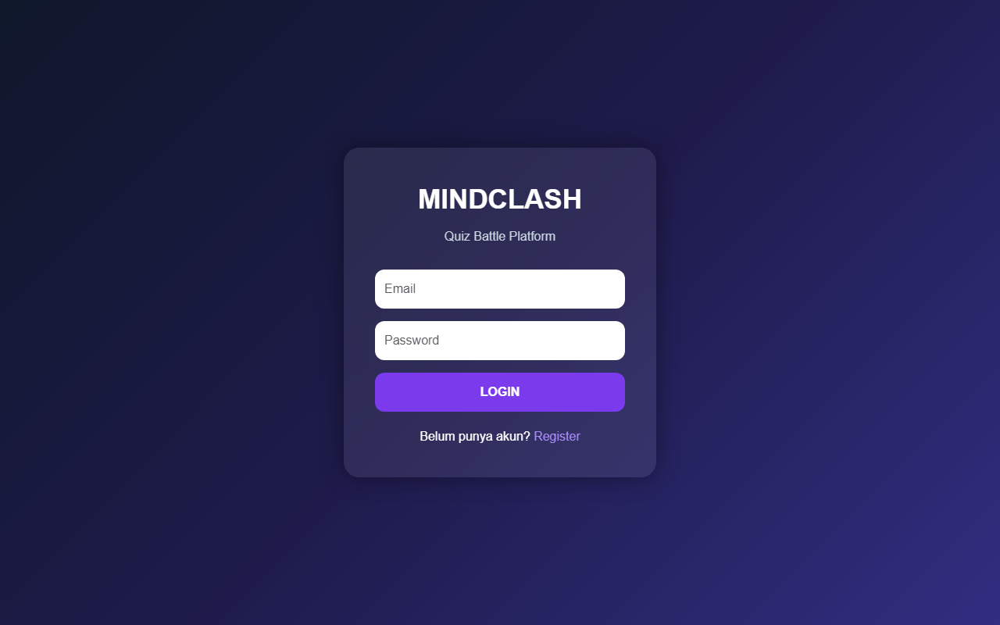

#### **B. Halaman Utama Siswa (Dashboard)**
Berikut adalah desain antarmuka dasbor utama siswa setelah berhasil masuk ke sistem. Pada bagian menu atas halaman ini, berdampingan dengan tombol **Lihat Peringkat Kelas**, terdapat tombol akses **Mode Mabar (Rooms)** untuk masuk ke kuis berkelompok:
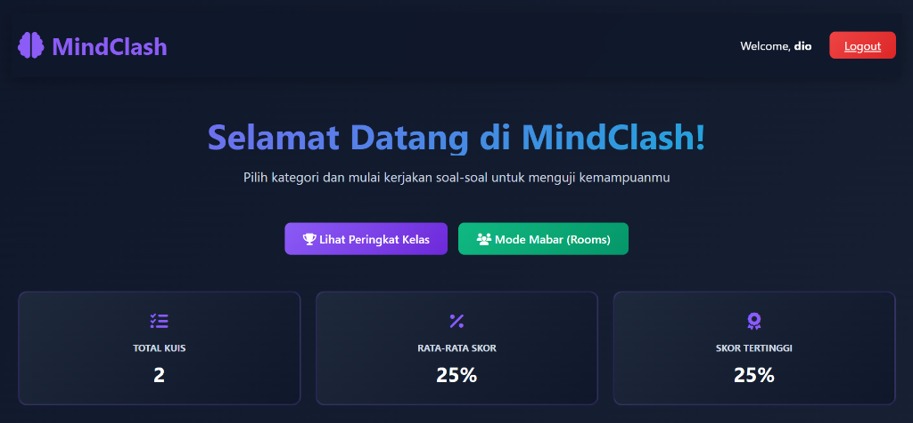

#### **C. Halaman Pengerjaan Kuis**
Berikut adalah desain antarmuka halaman pengerjaan kuis interaktif dengan timer dan progress bar:
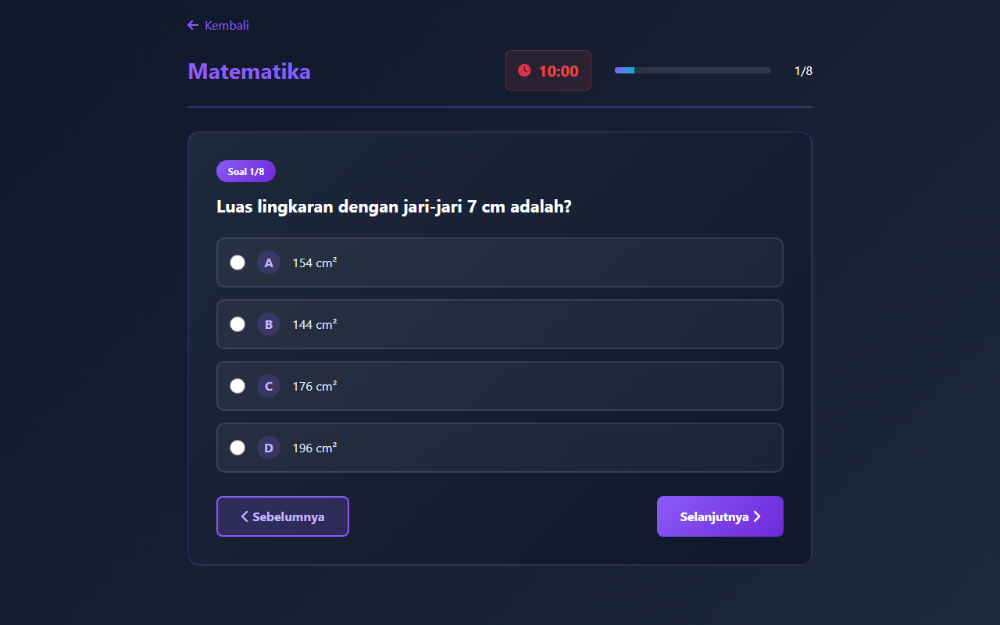

#### **D. Halaman Peringkat Kelas (Leaderboard)**
Berikut adalah desain antarmuka halaman peringkat siswa berdasarkan rata-rata nilai kelas:
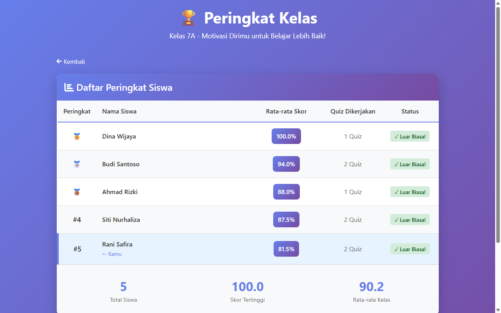

### **4.3 Deskripsi Tampilan**
Berikut adalah tampilan nyata (*screenshot* asli) dari antarmuka aplikasi web **MindClash** beserta rincian elemen penting yang disajikan:

#### **A. Tampilan Halaman Dashboard Siswa**
Dasbor utama menyajikan menu pemilihan kategori kuis secara visual, ringkasan statistik belajar siswa, serta tombol navigasi **Mode Mabar (Rooms)** yang terletak di samping kanan tombol **Lihat Peringkat Kelas**:


#### **B. Tampilan Halaman Pengerjaan Kuis**
Halaman ini menampilkan butir soal kuis secara interaktif per halaman dengan visualisasi sisa waktu hitung mundur dan kemajuan kuis:


#### **C. Tampilan Peringkat Kelas (Leaderboard)**
Leaderboard menyajikan rangking kompetisi antarsiswa sekelas secara transparan berdasarkan rata-rata nilai kuis:


#### **D. Tampilan Dasbor Admin**
Halaman manajemen admin untuk mengontrol soal, kategori, riwayat kuis siswa, dan cetak PDF:
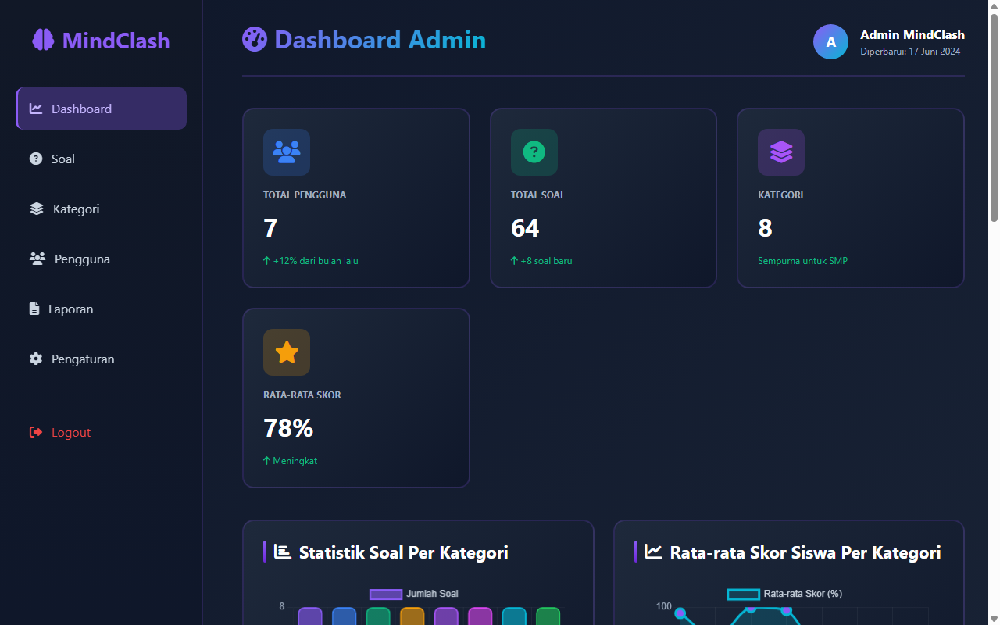

Tabel berikut menjelaskan fungsi lengkap dari setiap elemen antarmuka yang ada pada aplikasi MindClash:

| Nama Halaman | Elemen Antarmuka | Tipe Elemen | Deskripsi Fungsi |
| :--- | :--- | :--- | :--- |
| **Login / Register** | Form input kredensial | Form Input | Memvalidasi identitas user berdasarkan email, password, nama, dan kelas siswa. |
| **Dashboard Siswa** | Kartu Statistik | Informasi Visual | Menampilkan resume belajar siswa: akumulasi kuis, nilai rata-rata, dan rekor skor tertinggi. |
| | Kartu Kategori | Tombol & Teks | Menampilkan topik kuis yang tersedia beserta jumlah soal dan tombol pintas "Mulai Kuis". |
| **Pengerjaan Kuis** | Bar Kemajuan (*Progress Bar*) | Visual Bar | Menunjukkan rasio pengerjaan soal saat ini terhadap total keseluruhan pertanyaan kuis. |
| | Sisa Waktu (Timer) | Counter Angka | Menampilkan sisa waktu hitung mundur pengerjaan kuis. Jika habis, kuis otomatis dikirim. |
| | Pilihan Radio (A, B, C, D) | Radio Input | Area siswa memilih jawaban. Opsi yang dipilih berubah warna menjadi ungu transparan. |
| | Tombol Navigasi | Button | Tombol "Sebelumnya" dan "Selanjutnya" untuk perpindahan soal tanpa memuat ulang halaman. |
| **Hasil Kuis** | Lingkaran Nilai (*Score Circle*) | Informasi Visual | Lingkaran bercahaya gradasi ungu yang menampilkan nilai akhir siswa (skala 0-100). |
| | Ringkasan Akurasi | Tabel Informasi | Menampilkan detail jumlah soal, jumlah jawaban benar, dan persentase keberhasilan. |
| **Tinjau Jawaban (Review)**| Daftar Koreksi Soal | Panel List | Menampilkan seluruh soal kuis dengan penanda warna hijau untuk jawaban benar dan merah untuk jawaban salah. |
| **Peringkat (Leaderboard)**| Tabel Peringkat Kelas | Tabel Data | Menampilkan peringkat siswa di kelas yang sama berdasarkan nilai rata-rata tertinggi kuis secara real-time. |
| **Multiplayer Rooms (Index)**| Panel pencarian/daftar room kuis | Form & Tombol | Menyediakan form pembuatan room kuis baru dan input kode room unik untuk masuk room. |
| **Lobby Room** | Panel ruang tunggu kuis | List Pemain | Menampilkan daftar siswa yang telah bergabung, kode room, detail kategori kuis, dan tombol "Mulai Kuis" untuk host. |
| **Kuis Room** | Antarmuka kuis simultan | Soal & Timer | Menampilkan butir soal kuis dengan batas waktu room secara bersamaan dengan siswa lainnya. |
| **Leaderboard Room** | Tabel peringkat khusus room | Tabel Data | Menampilkan peringkat nilai kuis dari para siswa di dalam room tersebut secara langsung setelah kuis selesai. |

---
<div style="page-break-after: always;"></div>

# **BAB 5: IMPLEMENTASI DASAR**

### **5.1 Tools dan Teknologi**
Pengembangan aplikasi **MindClash** didasarkan pada teknologi modern berbasis web dengan spesifikasi sebagai berikut:
1. **Bahasa Pemrograman Utama:** PHP 8.2 (Backend) dan JavaScript Vanilla (Frontend).
2. **Framework Backend:** Laravel 12.0 (versi terbaru dengan performa optimal dan struktur kode bersih).
3. **Framework CSS / Styling:** Tailwind CSS v4.0 (untuk kemudahan modifikasi desain antarmuka responsif secara *utility-first*).
4. **Library Tambahan:** Barryvdh Laravel DomPDF (untuk menghasilkan cetak laporan kuis berformat PDF), Chart.js (untuk visualisasi grafik skor di sisi klien).
5. **Database Engine:** MySQL (Production/Development) atau SQLite (Local Testing).
6. **Server & Tools Pengembangan:** Laragon / XAMPP (Local Web Server), Node.js (untuk kompilasi aset frontend via Vite), Composer (PHP Dependency Manager), Visual Studio Code (IDE), dan Git (Version Control System).

### **5.2 Struktur Folder Proyek**
Berikut susunan folder penting pada proyek Laravel MindClash yang merepresentasikan arsitektur aplikasi (termasuk modul multiplayer):

```
proyek1Mindclash/
├── app/
│   ├── Http/
│   │   └── Controllers/               <-- Logika bisnis aplikasi
│   │       ├── AuthController.php      <-- Logika login, registrasi, & logout
│   │       ├── UserController.php      <-- Halaman kuis, hasil kuis, & leaderboard siswa
│   │       ├── QuestionController.php  <-- CRUD soal kuis oleh Admin
│   │       ├── CategoryController.php  <-- CRUD kategori kuis oleh Admin
│   │       ├── DashboardController.php <-- Statistik ringkas admin dasbor
│   │       ├── ReportController.php    <-- Logika export PDF & laporan admin
│   │       ├── SettingController.php   <-- Pembaruan profil admin & siswa
│   │       └── RoomController.php      <-- Logika pembuatan, lobby, & kuis Multiplayer Room
│   └── Models/                        <-- Definisi database entity (Eloquent)
│       ├── User.php
│       ├── Category.php
│       ├── Question.php
│       ├── QuizResult.php
│       ├── Room.php                    <-- Model tabel rooms kuis bersama
│       └── RoomUser.php                <-- Model pivot tabel room_users peserta
├── bootstrap/                         <-- Konfigurasi inisialisasi Laravel
├── config/                            <-- Berkas pengaturan global (session, database, dll)
├── database/
│   ├── migrations/                    <-- Skema tabel database (terdiri dari 9 file migrasi)
│   └── seeders/
│       └── DatabaseSeeder.php         <-- Pengisian data awal untuk uji coba
├── public/                            <-- Aset web publik (gambar, css, js terkompilasi)
├── resources/
│   ├── css/
│   │   └── app.css                    <-- Kustomisasi styles global Tailwind CSS
│   ├── js/
│   │   ├── app.js
│   │   └── bootstrap.js
│   └── views/                         <-- Template tampilan (Blade views)
│       ├── admin/                     <-- View manajemen admin (CRUD, reports, settings)
│       ├── auth/                      <-- View untuk login & register
│       ├── layouts/                   <-- Template layout induk admin & user
│       ├── questions/                 <-- View CRUD pertanyaan
│       └── user/                      <-- View dashboard kuis, hasil kuis, & leaderboard
│           └── rooms/                 <-- Sub-folder view kuis bersama (index, lobby, quiz, leaderboard)
├── routes/
│   └── web.php                        <-- Seluruh rute aplikasi (admin, user, & room)
├── composer.json                      <-- Daftar pustaka PHP dependensi proyek
├── package.json                       <-- Daftar pustaka JavaScript dependensi proyek
└── vite.config.js                     <-- Konfigurasi build tools Vite
```

### **5.3 Petunjuk Menjalankan Aplikasi**
Ikuti langkah-langkah di bawah ini untuk memasang dan menjalankan aplikasi MindClash di lingkungan lokal:

1. **Persiapan Lingkungan:**
   Pastikan komputer telah terinstal **PHP 8.2 atau lebih baru**, **Composer**, **Node.js (v18+)**, dan database server seperti **MySQL/MariaDB** (melalui Laragon atau XAMPP).

2. **Mengunduh/Clone Proyek:**
   Buka terminal, masuk ke direktori web server Anda, lalu lakukan clone repositori atau salin folder proyek.
   ```bash
   cd c:\laragon\www\proyek1Mindclash
   ```

3. **Memasang Dependensi PHP dan JavaScript:**
   Jalankan Composer untuk menginstal semua pustaka backend Laravel, dilanjutkan dengan npm untuk dependensi frontend:
   ```bash
   composer install
   npm install
   ```

4. **Konfigurasi Lingkungan (`.env`):**
   Salin berkas konfigurasi sampel menjadi `.env` jika belum ada:
   ```bash
   copy .env.example .env
   ```
   Buka file `.env` yang baru dibuat dan sesuaikan konfigurasi database Anda:
   ```env
   DB_CONNECTION=mysql
   DB_HOST=127.0.0.1
   DB_PORT=3306
   DB_DATABASE=proyek1mindclash
   DB_USERNAME=root
   DB_PASSWORD=
   ```

5. **Membuat Kunci Aplikasi (App Key):**
   Jalankan perintah berikut untuk menggenerasi kunci keamanan aplikasi Laravel Anda:
   ```bash
   php artisan key:generate
   ```

6. **Migrasi Database dan Seeding Data:**
   Buat database baru di MySQL dengan nama `proyek1mindclash`. Setelah itu, jalankan perintah migrasi beserta pengisian data uji coba awal (*database seeder*):
   ```bash
   php artisan migrate --seed
   ```
   *Catatan: Langkah ini akan membuat tabel-tabel kuis serta akun uji coba (Admin: admin@test.com / admin123; Siswa: rani@test.com, budi@test.com / password123).*

7. **Kompilasi Aset Frontend (Vite):**
   Gunakan perintah ini untuk memantau perubahan CSS/JS atau mengompilasi aset:
   ```bash
   npm run dev
   ```

8. **Menjalankan Server Lokal Laravel:**
   Di tab terminal baru, jalankan server pengembangan lokal bawaan Laravel:
   ```bash
   php artisan serve
   ```
   Aplikasi kini dapat diakses di browser melalui tautan `http://127.0.0.1:8000`.

---
<div style="page-break-after: always;"></div>

# **BAB 6: PENUTUP**

### **6.1 Kesimpulan**
Berdasarkan seluruh tahapan perancangan, pengembangan, dan uji coba yang dilakukan, proyek pengembangan aplikasi **MindClash** berhasil diselesaikan sepenuhnya dan menarik beberapa kesimpulan sebagai berikut:
1. Proyek ini berhasil mewujudkan sebuah solusi pembelajaran interaktif berbasis web (*gamified learning platform*) yang dirancang khusus untuk meningkatkan motivasi, keterlibatan aktif, dan kemandirian belajar siswa tingkat sekolah menengah.
2. Fitur-fitur utama seperti pengelompokan kuis berdasarkan kategori mata pelajaran, pembatasan waktu pengerjaan (timer), tampilan visual yang dinamis tanpa muat ulang halaman, kalkulasi nilai otomatis, serta **multiplayer room kuis** berkelompok berhasil diimplementasikan dengan baik menggunakan kolaborasi framework PHP Laravel 12 dan JavaScript vanilla.
3. Fitur gamifikasi penunjang seperti *Leaderboard* kelas dan *Room Leaderboard* terbukti dapat disajikan secara real-time berdasarkan hasil kuis siswa sekelas/se-room, memicu atmosfer kompetitif akademis yang sehat di kalangan siswa.
4. Fitur administrasi seperti manajemen data soal (CRUD), pengaturan profil, dan ekspor laporan nilai ke dalam format PDF berhasil mempermudah tugas guru dalam melakukan evaluasi hasil belajar siswa secara periodik.

Secara keseluruhan, tujuan pengembangan aplikasi MindClash telah tercapai 100%, menghasilkan aplikasi web yang fungsional, responsif, dan memiliki estetika desain gelap (Dark Mode) modern yang memikat bagi segmen pengguna pelajar digital saat ini.

### **6.2 Saran Pengembangan**
Meskipun sistem telah berjalan dengan baik, terdapat beberapa aspek yang dapat ditingkatkan pada pengembangan aplikasi MindClash selanjutnya:
1. **Penerapan Sistem Nyawa (Survival Mode) Sebenarnya:** Mengembangkan skema basis data tambahan untuk memfasilitasi "Sistem Nyawa" sesungguhnya di mana sesi kuis siswa akan langsung berhenti secara otomatis jika menjawab salah sebanyak 3 kali (sesuai ide dasar awal di Bab 1).
2. **Sistem Lencana (*Badges*) Dinamis:** Mengintegrasikan pencapaian lencana siswa ke dalam database secara otomatis berdasarkan rekor tertentu (misal: "100 Score Badge", "Speed Runner Badge").
3. **Penerapan Protocol WebSocket secara Penuh:** Mengintegrasikan Laravel Reverb atau Pusher pada fitur multiplayer room kuis untuk mengirimkan pembaruan data secara langsung (*push-based real-time notification*) pada ruang lobby saat ada pemain bergabung atau keluar tanpa memerlukan pemuatan ulang halaman secara periodik (*client polling*).
4. **Analisis Statistik Siswa Lanjutan:** Menambahkan antarmuka grafik perkembangan skor kuis siswa dari waktu ke waktu pada dasbor siswa untuk memfasilitasi evaluasi diri (*self-monitoring*).
5. **Mobile Application (PWA):** Mengembangkan aplikasi ke dalam bentuk Progressive Web App (PWA) agar siswa dapat mengakses kuis dengan mudah di perangkat ponsel pintar mereka layaknya aplikasi native.

---
<div style="page-break-after: always;"></div>

# **DAFTAR PUSTAKA**

[1] H. P. Adi and N. F. Ramadhani, "Pemanfaatan Metode Game Based Learning sebagai Upaya Peningkatan Minat dan Motivasi Belajar," *Cemerlang: Multidisciplinary Science Journal*, vol. 2, no. 1, pp. 12-25, 2024.

[2] A. S. Kania, A. Pratiwi, and R. S. Hayati, "Efektivitas Penggunaan Quizizz sebagai Media Evaluasi Interaktif pada Materi Informatika di SMP Negeri 1 Sanrobone," *Jurnal Komputer dan Informatika*, vol. 9, no. 1, pp. 490-499, 2026.

[3] M. S. Wibawa, "Pengaruh Media Pembelajaran Interaktif terhadap Hasil Belajar Siswa," *Jurnal Pendidikan Teknologi dan Kejuruan*, vol. 22, no. 2, pp. 145-155, 2024.

[4] A. A. Fauzi, F. Nugroho, W. Putra, and Y. A. Pratama, "Analisis dan Perbandingan Media Interaktif Kahoot dan Quizizz dalam Kemudahan Pembelajaran," *Jurnal Informatika dan Rekayasa Perangkat Lunak*, vol. 3, no. 1, pp. 88-95, 2025.

[5] D. T. Wahyuni, S. Purwati, and U. Mulawarman, "Pengaruh Penggunaan Media Pembelajaran Interaktif Zep Quiz dalam Model Game Based Learning (GBL) terhadap Motivasi dan Hasil Belajar Kognitif Siswa pada Pembelajaran IPA Kelas VII SMP," *Jurnal Pendidikan Sains Indonesia*, vol. 14, no. 2, pp. 4366-4370, 2026.

---
<div style="page-break-after: always;"></div>

# **SEKILAS DOKUMEN APLIKASI (COVER BELAKANG)**

Buku ini merupakan dokumen perancangan dan implementasi aplikasi **MindClash**, sebuah solusi pengiriman cepat, aman, dan terpercaya bagi media belajar kuis interaktif siswa. Dokumen ini disusun secara sistematis untuk memberikan pemahaman menyeluruh mengenai konsep, desain, hingga implementasi aplikasi.

### **ISI DOKUMEN**
1. **Pendahuluan:** Latar belakang, ide dasar, tujuan, dan ruang lingkup pengembangan aplikasi.
2. **Deskripsi Sistem:** Gambaran umum aplikasi, kebutuhan fungsional, dan non-fungsional.
3. **Perancangan Sistem:** Arsitektur sistem, workflow, class diagram, dan ERD database.
4. **Desain Antarmuka:** Konsep desain, mockup/wireframe, dan deskripsi tampilan.
5. **Implementasi Dasar:** Tools teknologi, struktur folder, dan petunjuk menjalankan aplikasi.
6. **Penutup:** Kesimpulan hasil proyek dan saran pengembangan masa depan.

> "Kuis interaktif, belajar asyik, dan membangun kompetisi sehat bagi para siswa generasi masa depan adalah tujuan utama kami."

**DOKUMEN INI MILIK PROGRAM STUDI D4 TEKNIK INFORMATIKA ULBI**
Sebagai produk hasil pembelajaran tahun ke-1 program diploma 4.
*Barcode:* **9 786238 457893** (PROYEK 1 - MINDCLASH)
